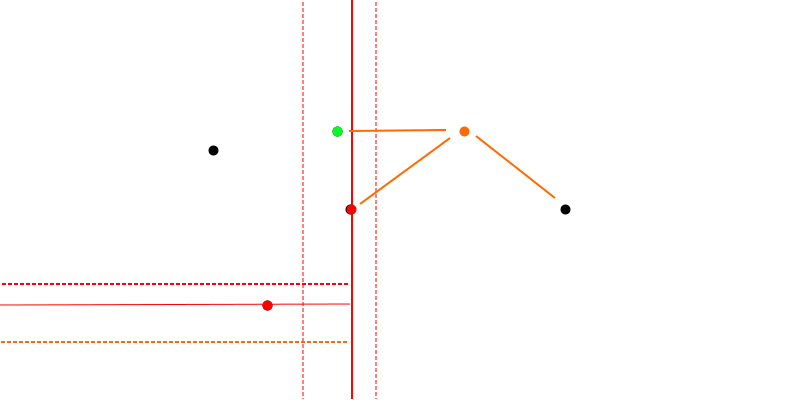
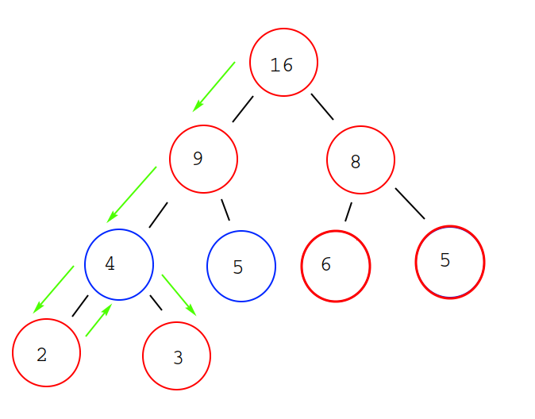

# Optimizing Point Cloud Algorithms

Tools used:  
g++ 7.4.0  
Python 3.6.8  
CUDA  

Spill tree mechanism for kNN  
  
<kbd></kbd>  
Query point (orange). 
Subspaces are partitioned by circulating across all the dimensions.  
Points selected as partitioning plane (red). 
Partitioning stops when only one point or less remains in a subspace.  
Points in same subspace (including overlapping region and median points) are candidates for nearest neighbour.  
  
Hybrid Tree Structure  
  
<kbd></kbd>  
Spill trees (red) do not backtrack for it is expected that the overlapping regions would account for points near the borders.  
Spill trees are implemented when efficiency is favoured over accuracy.  
  
Metric trees (blue) require backtracking. This allows for multiple nodes to be traversed to account for all possibilities.  
Metric trees are implemented when accuracy is favoured over efficiency.  
